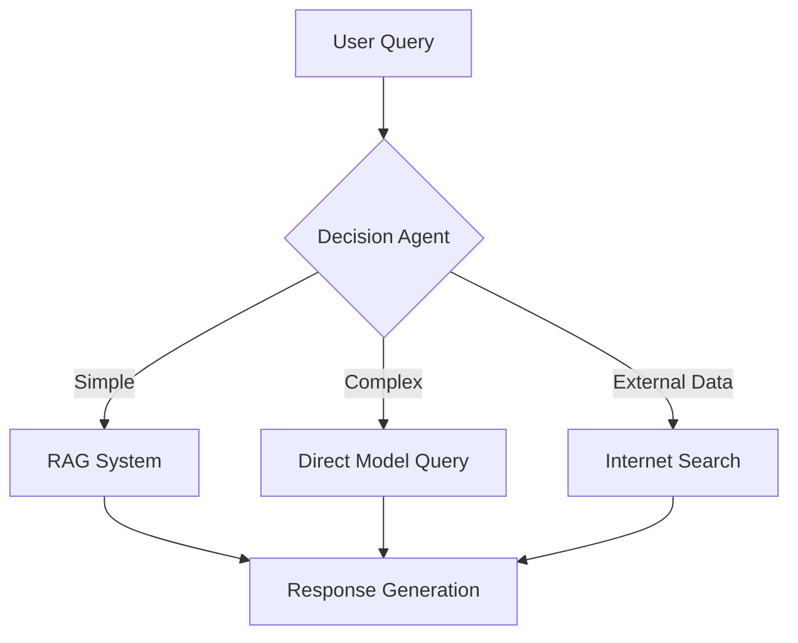

# Hierarchical RAG System Architecture for OECD BEPS Pillar Two

## 1. System Architecture Overview
### Hierarchical RAG Design


### Decision-Making Agent Flow


### Component Interaction


## 2. Technical Specifications

### Chunking Strategy
We use a two-level chunking approach optimized for OECD BEPS documents:

1. **Document Segmentation**: 
   - Split documents by logical sections (Articles, Annexes, Examples)
   - Use layout-aware parsing for PDFs (PyMuPDF)
   - Preserve document hierarchy (Part > Chapter > Section)

2. **Semantic Chunking**:
   - Chunk Size: 1000 tokens (tiktoken count)
   - Overlap: 200 tokens for context preservation
   - Split at natural language boundaries (sentences, paragraphs)
   - Special handling for tables and formulas

### Model Selection
| Component          | Model              | Context | Specialization        | Quantization |
|--------------------|--------------------|---------|-----------------------|-------------|
| Embeddings         | Mistral Embed      | 8192    | Document encoding     | 8-bit       |
| Generation         | Phi3               | 128k    | Response synthesis    | 4-bit       |
| Summarization      | Phi3               | 128k    | Layer 1 abstraction   | 4-bit       |
| Cross-Encoder      | MiniLM-L6          | 512     | Re-ranking           | None        |

**Selection Rationale**:
- Mistral Embed: State-of-the-art for retrieval quality
- Phi3: Cost-performance balance for long-context tasks
- MiniLM: Efficient re-ranking for precision improvement

### Vector Storage
**FAISS Implementation**:
- Index Type: HNSW (Hierarchical Navigable Small World)
- Parameters: 
  - M: 32 (number of bi-directional links)
  - efConstruction: 200
  - efSearch: 100
- Persistence: Automatically save/load index from `data/processed/faiss_index`

**Metadata Management**:
- Each chunk has a unique UUID
- Metadata stored in JSONL format (`data/processed/metadata.jsonl`)
- Fields: 
  - chunk_id: UUID
  - document_id: Source document identifier
  - start_page: Starting page of chunk
  - end_page: Ending page of chunk
  - section: Document section title
  - keywords: Extracted key terms

### Retrieval Process
1. **Hierarchical Search**:
   - First retrieve top-3 summaries (Layer 1)
   - Then retrieve top-5 chunks (Layer 2) from relevant documents
2. **Re-ranking**:
   - Cross-encoder (MiniLM) re-ranks chunks
   - Combines semantic similarity with keyword matching
3. **Context Compression**:
   - Apply extractive summarization for long contexts
   - Preserve legal terminology and numerical data

### Decision Agent Logic
```python
def route_query(query: str) -> Dict:
    complexity = analyze_complexity(query)
    requires_external = requires_external_data(query)
    
    if requires_external:
        return {"route": "internet", "engine": "brave_search"}
    elif complexity > 0.7:
        return {"route": "rag", "top_k": 7}
    else:
        return {"route": "direct", "model": "phi3"}
```

**Decision Factors**:
- Complexity Score (0-1): Based on:
  - Number of legal entities mentioned
  - Presence of multi-part questions
  - Reference to specific articles/paragraphs
- External Data Requirements:
  - Keywords: "current", "recent", "latest"
  - Time-sensitive references
  - Country-specific regulations

## 3. Project Structure

### Directory Descriptions
```plaintext
hierarchical-rag-beps/
├── src/                  # Core application source code
│   ├── models/           # Model wrappers and interfaces
│   │   ├── embedding.py  # Mistral Embed integration
│   │   ├── generation.py # Phi3 model interface
│   │   └── reranker.py   # Cross-encoder implementation
│   ├── rag/              # Hierarchical RAG implementation
│   │   ├── layer1.py     # Summary/metadata retrieval
│   │   ├── layer2.py     # Content chunk retrieval
│   │   └── retriever.py  # Unified retrieval interface
│   ├── agent/            # Decision-making agent
│   │   ├── router.py     # Query routing logic
│   │   └── analyzer.py   # Query complexity analysis
│   └── utils/            # Shared utilities
│       ├── chunker.py    # Document segmentation logic
│       ├── logger.py     # Custom logging configuration
│       └── validator.py  # Data validation helpers
├── data/                 # Data management
│   ├── raw/              # Original OECD documents (PDFs)
│   ├── processed/        # Processed data
│   │   ├── summaries/   # Layer 1 summary files
│   │   ├── chunks/       # Chunked content files
│   │   └── faiss_index/  # Vector store indexes
│   └── evaluations/      # Evaluation datasets
│       ├── test_cases/   # Manual test queries
│       └── benchmarks/   # Standard evaluation benchmarks
├── tests/                # Testing infrastructure
│   ├── unit/             # Unit tests
│   └── integration/      # End-to-end tests
├── config/               # Configuration management
│   ├── default.yaml      # Base configuration
│   └── production.yaml   # Production overrides
└── docs/                 # Documentation
    ├── architecture.md   # System design documentation
    └── api-reference/    # API documentation
```

### File Conventions
- Python files use snake_case naming
- Configuration files use YAML format
- Test files match source files with `test_` prefix
- Data files preserve original OECD document names
- Documentation uses Markdown format

## 4. Component Interfaces

### Document Processor
```python
def process_document(
    document_path: str, 
    config: Optional[ChunkingConfig] = None
) -> DocumentProcessingResult:
    """Processes OECD BEPS documents into structured chunks and summaries
    
    Args:
        document_path: Path to PDF document
        config: Chunking configuration (defaults to global config)
    
    Returns:
        DocumentProcessingResult: 
            chunks: List[Chunk] - Processed content chunks
            summary: Summary - Document-level abstract
            metadata: DocumentMetadata - Source document info
    
    Raises:
        UnsupportedFormatError: For non-PDF documents
        ParsingError: For malformed document structures
    """
```

### Hierarchical Retriever
```python
def retrieve(
    query: str, 
    top_k_layer1: int = 3,
    top_k_layer2: int = 5,
    similarity_threshold: float = 0.65,
    rerank: bool = True
) -> RetrievalResult:
    """Executes two-stage retrieval for hierarchical RAG
    
    Args:
        query: User question in natural language
        top_k_layer1: Number of summaries to retrieve
        top_k_layer2: Number of chunks to retrieve per summary
        similarity_threshold: Minimum relevance score
        rerank: Apply cross-encoder re-ranking
    
    Returns:
        RetrievalResult:
            layer1_results: List[SummaryResult]
            layer2_results: List[ChunkResult]
            scores: List[float] - Relevance scores
    
    Raises:
        IndexNotLoadedError: If FAISS index is missing
        EmptyResultError: When no matches found
    """
```

### Decision Agent
```python
def route_query(
    query: str, 
    conversation_history: Optional[List[Message]] = None,
    use_heuristics: bool = True
) -> RoutingDecision:
    """Determines optimal processing path for queries
    
    Args:
        query: Current user question
        conversation_history: Previous messages in session
        use_heuristics: Apply rule-based fallback
    
    Returns:
        RoutingDecision:
            route: Literal["rag", "direct", "internet"]
            confidence: float (0-1)
            model: Optional[str] - Model to use
            parameters: Dict - Route-specific parameters
    
    Raises:
        InvalidQueryError: For empty/malformed queries
"""
```

### Response Generator
```python
def generate_response(
    query: str,
    context: Union[str, List[ChunkResult]],
    route: Literal["rag", "direct", "internet"],
    model: str = "phi3",
    max_tokens: int = 1024
) -> GeneratedResponse:
    """Synthesizes final response using selected strategy
    
    Args:
        query: Original user question
        context: Retrieved content or search results
        route: Selected processing route
        model: Generator model to use
        max_tokens: Response length limit
    
    Returns:
        GeneratedResponse:
            response: str - Natural language answer
            sources: List[Source] - Attribution references
            confidence: float (0-1)
    
    Raises:
        ContextTooLargeError: When context exceeds model limits
        GenerationError: For model failures
    """
```

## 5. Configuration Schema

The system uses a hierarchical configuration approach with environment-specific overrides. All configurations are stored in YAML files.

### Base Configuration (config/default.yaml)
```yaml
system:
  env: "development"
  log_level: "INFO"

models:
  embedding:
    name: "mistral-embed"
    params:
      temperature: 0.2
      batch_size: 32
      device: "cuda:0"  # or "cpu"
  generation:
    name: "phi3"
    params:
      max_tokens: 1024
      temperature: 0.7
      top_p: 0.9
  reranker:
    name: "MiniLM-L6"
    params:
      batch_size: 64

retrieval:
  layer1:
    top_k: 3
    similarity_threshold: 0.6
  layer2:
    top_k: 5
    similarity_threshold: 0.65
  rerank: true
  rerank_top_n: 10

chunking:
  strategy: "semantic"
  size: 1000
  overlap: 200
  max_tokens_per_chunk: 1200
  preserve_tables: true
  preserve_formulas: true

agent:
  complexity_threshold: 0.7
  external_data_keywords: ["current", "recent", "latest"]
  default_route: "rag"

storage:
  faiss:
    index_type: "HNSW"
    m: 32
    ef_construction: 200
    ef_search: 100
  metadata:
    format: "jsonl"
    path: "data/processed/metadata.jsonl"

evaluation:
  metrics:
    - "precision@1"
    - "precision@3"
    - "recall@5"
    - "faithfulness"
    - "answer_relevance"
  test_suites:
    - "beps_core"
    - "beps_edge_cases"
```

### Environment Overrides
- `config/development.yaml`: Local development settings
- `config/production.yaml`: Production deployment settings
- `config/test.yaml`: Testing configuration

### Configuration Loading Order
1. Load `default.yaml` as base configuration
2. Merge environment-specific overrides (e.g., `production.yaml`)
3. Apply command-line arguments
4. Apply runtime environment variables (prefixed with `BEPS_RAG_`)

### Validation
All configurations are validated against a JSON schema:
```python
class ConfigSchema(BaseModel):
    system: SystemConfig
    models: ModelConfigs
    retrieval: RetrievalConfig
    chunking: ChunkingConfig
    agent: AgentConfig
    storage: StorageConfig
    evaluation: EvaluationConfig